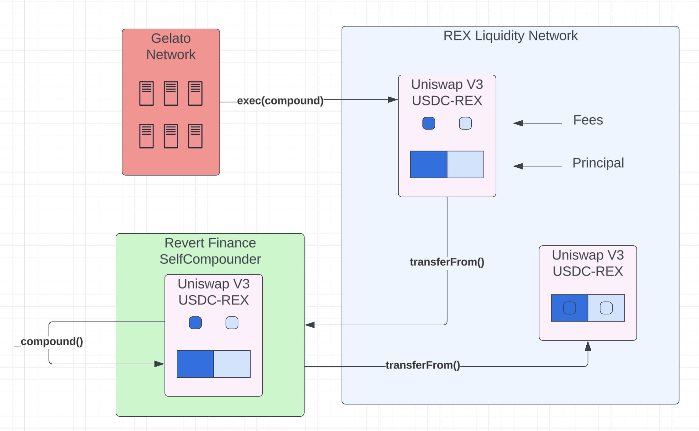
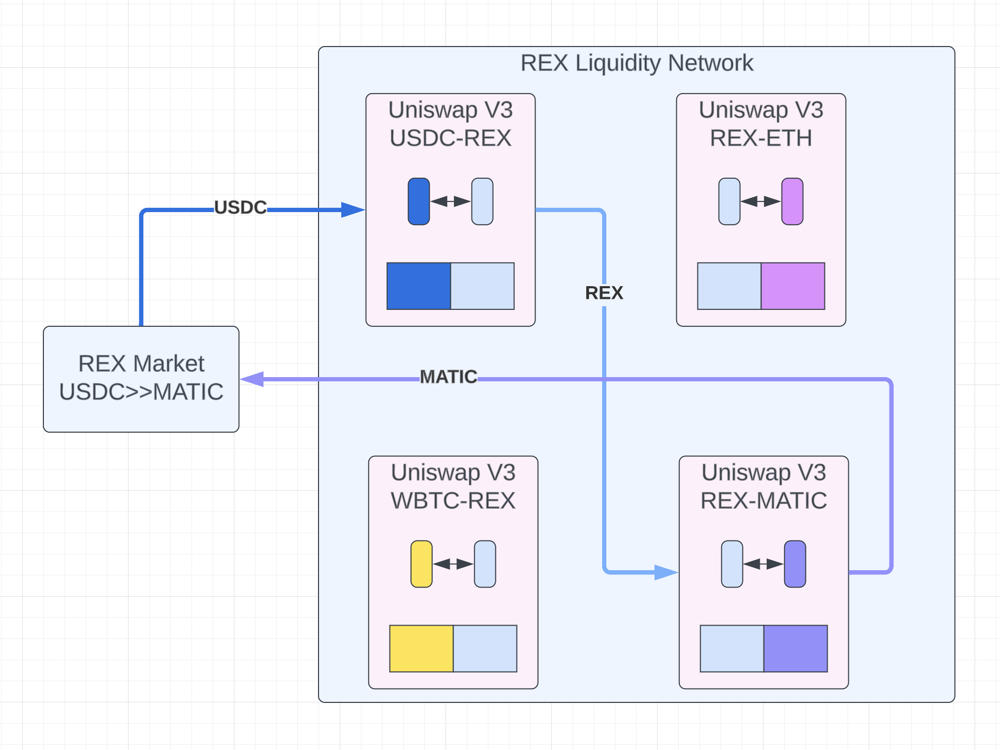

## What is REX Liquidity Network?
The REX Liquidity Network is a collection of Uniswap V3 Liquidity Pool Positions that autocompound their fees to increase the liquidity overtime. This network is designed to permanently lock liquidity for the REX Protocol. In this way, REX Liquidity Network serves as an ownerless and immutable liquidity provider that can be used by REX Protocol and other protocols as well. 

## How it works
Fees accumulate in the Uniswap V3 positions as they get used by traders, which will primarily be REX Protocol. Other traders will use these pools as well if there exists a path through the network that offers the best path to fulfill a trade. Gelato will execute the transaction to compound fees once enough accumulates such that 1% of the fees will cover the transaction fee. When compounding, the Uniswap V3 position NFT is transferred to Revert Finance’s SelfCompounder contract which performs the fee compounding operations. SelfCompounder will then transfer the NFT back to the REX Liquidity Network contract after the fees are compounded back into the position.

## Permenant Protocol Owned Liquidity
The REX Liquidity Network is an ownerless and immutable contract that permanently locks liquidity to power the REX Protocol in perpetuity. Fees collected are automatically compounded back into the pools in the protocol using Gelato Network and Revert Finance’s SelfCompounder.

## How it's used

The REX Liquidity Network is used as the liquidity source for REX Markets. Swaps on REX Markets route through the REX token. As shown below, a swap from USDC to ETH would route though the REX token using the path `[USDC, REX, ETH]`. This ensures that the REX liquidity network collects the inescapable AMM fees paid by REX Markets. Anyone REX token holder can provide liquidity to the network by depositing into tokens into the liqudity pools that make up the network. Other protocols can also use the REX Liquidity Network as a liquidity source for their own protocols.
